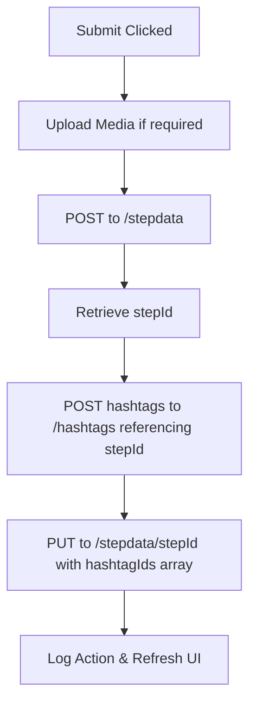
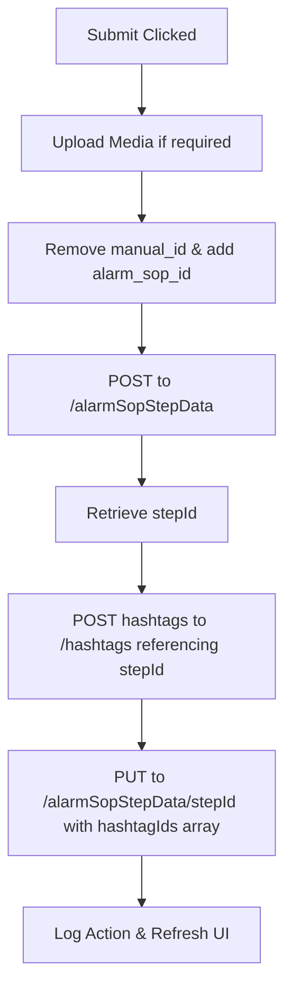

# Add Step Modal Component Documentation

This document explains the UI layout, functionalities, state variables, and backend integration workflows of the `AddStepDialog` modal component in the **Arizon Integration** project. 

Use this guide to replicate the modal and its behavior in your other project.

---

## 1. File Locations

To replicate this functionality, you will need the following core files:
* **Main Modal Component**: [AddStepDialog.jsx](file:///d:/Arizon/arz-integration/src/layouts/machineData/AddStepDialog.jsx)
* **Library Gallery Browser**: [GalleryModal.jsx](file:///d:/Arizon/arz-integration/src/layouts/machineData/GalleryModal.jsx)
* **Expected Time Picker**: [CustomDurationPicker.jsx](file:///d:/Arizon/arz-integration/src/components/Utils/CustomDurationPicker.jsx)

---

## 2. Props & Configurations

The `AddStepDialog` receives several props to establish the context under which a step is added:

| Prop | Type | Description |
| :--- | :--- | :--- |
| `open` | `Boolean` | Controls the visibility of the dialog. |
| `setOpen` | `Function` | State setter function to close/open the dialog. |
| `data` | `String` | The current Machine ID (`mid`). Used to query sensors and files. |
| `machinetype` | `String` | Represents the type of machine. Used for tagging hashtags. |
| `manual_id` | `String` | ID of the current SOP manual (Training, Maintenance, etc.). |
| `alarm_sop_id` | `String` | ID of the Alarm SOP (if `parent === "Alarm SOP"`). |
| `machineName` | `String` | Name of the machine, used for CFR logging. |
| `parent` | `String` | Context indicator (e.g., `"Maintenance"`, `"Alarm SOP"`, `"Training"`). |
| `currentMode` | `String` | Theme indicator (`"Light"` or `"Dark"`), used to toggle MUI stylings. |
| `currentStepIndex` | `Number` | The index of the step from which the user clicked "Add Step" (helps pre-select the insertion position). |
| `setRefreshCount` | `Function` | Callback to trigger data re-fetching in parent view. |
| `refreshCount` | `Number` | Refresh state counter. |
| `handleHastageData` | `Function` | Callback to update hashtag states globally. |
| `hashArray` | `Array` | List of existing hashtags in the system for autocomplete dropdown. |

---

## 3. UI Layout & Fields

The modal is built using **Material-UI (MUI)**. It adopts responsive grids and flexbox positioning. It contains the following form fields:

### A. General Text Fields (Text Inputs)
1. **Step Title (`title` - Required)**: Standard text field. Values are trimmed of white spaces on blur.
2. **Step Description (`desc` - Required)**: Multi-line text field (2 rows). Holds the descriptive text for the step.
3. **Answer (`ans` - Required)**: Multi-line text field (2 rows). Holds the correct expected answer or action validation text.
4. **Step Significance (`stepSignificance` - Required)**: Multi-line text field (2 rows). Explains the importance of the step.

### B. Positioning Selector (`insertIndex` - Required if steps exist)
* If steps already exist for the manual, a dropdown text field is shown letting the user select where to insert the new step (from `1` to `steps.length + 1`). 
* If `currentStepIndex` is passed from the parent, the select input defaults to `currentStepIndex + 2` (equivalent to inserting directly after the clicked step, taking into account 1-based indexing).

### C. Sensor Selection (Dynamic Array Add/Remove)
* Consists of an API-driven select menu (`Select`) populated with machine sensors.
* Displays tag names along with their current values (e.g., `SensorTag (12.4)`).
* Users click a green **Add (+)** button to append the selected sensor to a list.
* Rendered tags include a red **Remove (-)** button to remove individual items from the selection.

### D. QR Code Integration (Dynamic Array Add/Remove)
* A text input where users type a QR code signature.
* Clicking the green **Add (+)** button stores the code in a local array.
* Renders a list of the added QR codes with options to remove them individually.

### E. Tolerance & Expected Time
* **Tolerance (in %)**: A numeric input field specifying the allowed operational offset.
* **Expected Time**: Renders `DurationPicker` showing side-by-side inputs for **Hours**, **Minutes**, and **Seconds**. The value is converted into total seconds prior to submission.

### F. Step Type and Format (Metadata Dropdowns)
* **Format (Required)**: Selection dropdown with `"image"`, `"video"`, `"audio"`, or `"text"`.
* **Type (Required)**: Selection dropdown with `"info"`, `"camera"`, `"critical"`, or `"normal"`.

### G. Media Selection (Upload vs Library)
When the format selected is **not** `"text"`, the UI dynamically displays a **Media Source** toggle:
1. **Upload New File**: Renders a `DropzoneArea` accepting drag-and-drop file uploads (capped at 50MB). Files are validated against MIME lists for the selected format.
2. **Select from Library**: Renders a button that opens `GalleryModal` containing files existing in the system gallery/file-manager, filtered automatically to display only files matching the chosen format.
* **Video Duration Parsing**: If a video is chosen, a hidden `<video>` metadata loader extracts the exact length of the file and renders a read-only duration preview in `hh:mm:ss` format.
* **Preview Box**: Uses a helper component `GetPreviewComponent` to display the selected image, video, or audio base64/URL preview.

### H. Hashtag Section (Conditional)
Only visible if `parent` is `"Maintenance"` or `"Alarm SOP"`:
1. **Search Existing**: An Autocomplete search bar filtered by `hashArray`.
2. **Add New**: A text field to input custom tags, with an "ADD NEW" button.
* Displayed below as horizontal items with a red close icon.

---

## 4. Key Logical Workflows

### A. Initialization & API Loading (`useEffect`)
When the modal opens (`open === true`):
1. **Sensor Data**: Calls `GET /livedata/getFromMachine/${data}` to populate the sensor list.
2. **Existing Steps**: 
   * If `parent !== "Alarm SOP"`, calls `GET /stepdata/getManualSteps/${manual_id}`.
   * If `parent === "Alarm SOP"`, calls `GET /alarmSopStepData/getAlarmSOPSteps/${alarm_sop_id}`.
3. **Files**: Calls `GET /files` to load library files for the gallery.
4. **Folders**: Calls `GET /folders` to locate the folder matching the current Machine ID (`data`). If matched, it saves its ID to `parentId` to associate newly uploaded files with the correct folder.

### B. Dynamic Step Ordering (Sort Key Math)
Rather than updating index positions of all existing database steps when inserting a new step in the middle of a list, the modal computes a fractional `sortKey`:

```javascript
let sortKey = 100;
let index = steps.length || 0;

if (steps && steps.length > 0 && insertIndex) {
  const idx = Number(insertIndex);
  
  // Sort the existing steps in memory by their sortKey
  const sorted = [...steps].sort((a, b) => (a.sortKey ?? 0) - (b.sortKey ?? 0));
  
  if (idx === 1) {
    // Inserting at the top of the list
    const firstSortKey = sorted[0]?.sortKey ?? 100;
    sortKey = Math.floor(firstSortKey / 2);
  } else if (idx === sorted.length + 1) {
    // Inserting at the end of the list
    sortKey = (sorted[sorted.length - 1]?.sortKey ?? 100) + 100;
  } else {
    // Inserting in-between two steps
    const left = sorted[idx - 2];
    const right = sorted[idx - 1];
    sortKey = Math.floor(((left?.sortKey ?? 0) + (right?.sortKey ?? 0)) / 2);
  }
  index = idx - 1;
}
```

### C. File Uploading & Library Synchronization
* If uploading a file, the code sends a `POST` request to the storage server: `${dbConfig.url_storage}/upload` using `FormData`. It tracks upload progress to show a loading overlay with a circular progress percentage.
* Upon successful storage, it immediately performs a background sync `POST` to the file manager database `/files`, passing:
  ```json
  {
    "url": "uploaded_storage_url",
    "name": "filename.ext",
    "creator": "current_user_email",
    "parent_id": "parentId",
    "format": "selected_format",
    "mid": "machine_id"
  }
  ```
  This automatically registers the newly uploaded file inside the gallery library.

### D. Step Submission & Relationship Mapping (`handleSubmit`)
Depending on the parent context, different database requests are dispatched:

#### 1. Maintenance


#### 2. Alarm SOP


#### 3. Training & Other SOPs
* Dispatches `POST` request straight to `/stepdata`. No hashtag mapping needed.

---

## 5. Form Validation Rules

The **Add Step** button is disabled until all critical fields are valid:
* `title` is not empty.
* `desc` is not empty.
* `type` is selected.
* `format` is selected.
* If `format` is not `"text"`, `imageUrl` must be populated (meaning a file has been uploaded or chosen from the library).
* `insertIndex` must be specified and must fall between `1` and `steps.length + 1`.

---

## 6. API References

| Action | HTTP Method | Endpoint | Description |
| :--- | :--- | :--- | :--- |
| **Get Machine Sensors** | GET | `${dbConfig.url}/livedata/getFromMachine/${machineId}` | Fetches sensor listings for selection. |
| **Get Manual Steps** | GET | `${dbConfig.url}/stepdata/getManualSteps/${manualId}` | Retrieves existing steps for position sorting. |
| **Get Alarm SOP Steps** | GET | `${dbConfig.url}/alarmSopStepData/getAlarmSOPSteps/${alarmSopId}` | Retrieves existing alarm steps for position sorting. |
| **Get Files** | GET | `${dbConfig.url}/files` | Queries system library gallery files. |
| **Get Folders** | GET | `${dbConfig.url}/folders` | Finds target folder matching Machine ID. |
| **Upload Media** | POST | `${dbConfig.url_storage}/upload` | Uploads file to remote storage. |
| **Sync File Record** | POST | `${dbConfig.url}/files` | Registers upload details inside the gallery database. |
| **Add Step** | POST | `${dbConfig.url}/stepdata` | Creates standard manual step. |
| **Add Alarm SOP Step** | POST | `${dbConfig.url}/alarmSopStepData` | Creates Alarm SOP step. |
| **Add Hashtags** | POST | `${dbConfig.url}/hashtags` | Links hashtag strings to `step_id`. |
| **Link Step Hashtags** | PUT | `${dbConfig.url}/stepdata/${stepId}` | Updates standard step with hashtags array. |
| **Link Alarm Step Tags** | PUT | `${dbConfig.url}/alarmSopStepData/${stepId}` | Updates alarm step with hashtags array. |
