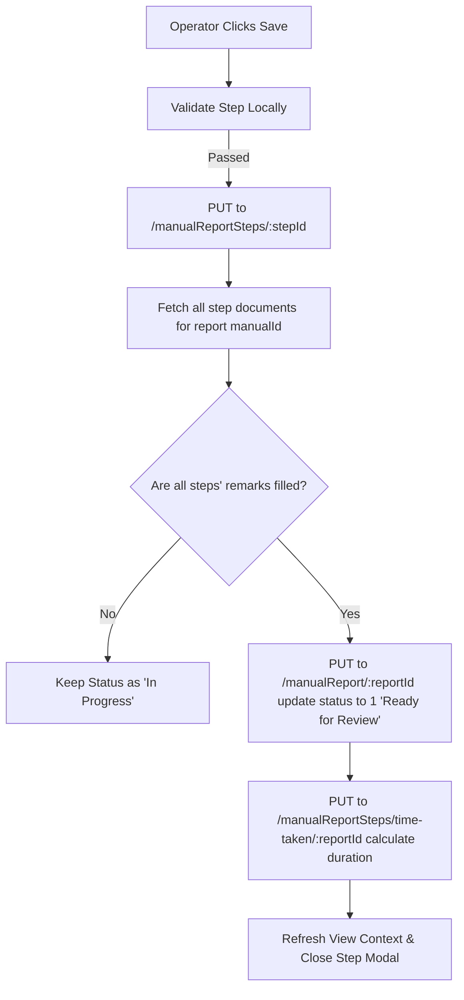

# Perform Task / SOP Modal Component Documentation

This document explains the UI layout, functionalities, sub-components, validation checks, and parent integration workflows of the `PerformModal` component, which is used by operators to execute tasks (SOPs, Maintenance checklists, Training requests, Changeovers, and Alarm SOPs).

---

## 1. File Structure & Component Locations

To implement the complete operator task execution UI, you will need the following files:

* **Main Modal Container**: [PerformModal.jsx](file:///d:/Arizon/arz-integration/src/components/reports/PerformModal.jsx)
* **Step Details & Inputs Layout**: [EditSelectedComponent.jsx](file:///d:/Arizon/arz-integration/src/components/reports/EditSelectedComponent.jsx)
* **Validation Utilities**: [utils.js](file:///d:/Arizon/arz-integration/src/components/reports/utils.js)
* **Media Attachment Inputs**: [file-ipnut.jsx](file:///d:/Arizon/arz-integration/src/components/reports/file-ipnut.jsx) (contains filename typo *ipnut*)
* **Live Camera Stream Capture**: [camera-capture.jsx](file:///d:/Arizon/arz-integration/src/components/reports/camera-capture.jsx)
* **QR Barcode Scanner Modal**: [scannerModal.jsx](file:///d:/Arizon/arz-integration/src/components/reports/scannerModal.jsx)
* **QR Camera Engine**: [scanner.jsx](file:///d:/Arizon/arz-integration/src/components/reports/scanner.jsx)

---

## 2. Props & Configurations

The `PerformModal` is initialized with the following props:

| Prop | Type | Description |
| :--- | :--- | :--- |
| `open` | `Boolean` | Controls the visibility of the dialog. |
| `handleClose` | `Function` | Callback to close the dialog. |
| `rowData` | `Object` | The main report data object (contains `report_status`, `title`, `email`, etc.). |
| `carousalData` | `Array` | List of step objects associated with the current report. |
| `currStep` | `Number` | The active step index (0-indexed) the operator is currently viewing. |
| `setCurrStep` | `Function` | Updates the active step index. |
| `handleSubmit` | `Function` | Callback trigger when the operator saves progress on a step. |
| `setEValue` | `Function` | Sets the image URL for the enlarged dialog preview. |
| `setEnlarge` | `Function` | Controls the visibility of the enlarged image dialog. |

---

## 3. UI Layout & Operators Experience

The `PerformModal` is designed as a **sliding bottom-up carousel** (`Slide` transition) to keep the operator focused on one step at a time.

```
+-------------------------------------------------------------------------+
| [Report Title]                       [Status: In Progress]              |
+-------------------------------------------------------------------------+
|                                                                         |
|  +------------------------------+  +---------------------------------+  |
|  | LEFT PANEL: INSTRUCTIONS     |  | RIGHT PANEL: OPERATOR ACTIONS   |  |
|  |                              |  |                                 |  |
|  | - Step Number & Title        |  | - QR Codes (Required/Scanned)   |  |
|  | - Image/Video/Audio Player   |  | - Scan QR Button (Camera icon)  |  |
|  | - Enlarge Option for images  |  | - Attachments List & Upload     |  |
|  |                              |  | - Remarks Input (Multi-line)    |  |
|  |                              |  | - [Save Button]                 |  |
|  +------------------------------+  +---------------------------------+  |
|                                                                         |
+-------------------------------------------------------------------------+
|  [Prev Button] <               Step 3 / 10               > [Next Button] |
+-------------------------------------------------------------------------+
```

### A. Dialog Header
* Displays the report name alongside the initiating operator's username (extracted from email).
* Shows the status badge: `"In Progress"` (yellow), `"Ready for Review"` (blue), or `"Reviewed"` (green).

### B. Left Section (Instructional Media)
* **Step Title**: Rendered clearly in the top corner (e.g., `Step 3: Check Oil Level`).
* **Dynamic Media Loader**: Automatically formats and renders the attachment URL linked with the step:
  * **Image**: Renders inline with a hoverable **Enlarge** icon that opens a high-res lightbox dialog.
  * **Video**: Renders custom `<video>` player with loading circular indicators, play controls, and buffering event handlers.
  * **Audio**: Renders a standard `<audio>` playback console.

### C. Right Section (Operator Inputs & Action)
1. **QR Codes Panel**:
   * Shows a list of comma-separated QR values required for the step.
   * Renders the scanned results in red if incomplete, and green once matched.
   * Trigger button calls `ScannerModal` to scan barcodes using the web camera.
2. **Attachments Panel**:
   * Displays upload history as interactive chips that operators can click to review in a new browser tab.
   * Trigger button (`FileUpload`) lets the operator choose an image or open the **Webcam Capture Modal** to snap a live photo of their task.
3. **Remarks Panel**:
   * A required multi-line text input for comments, notes, or explanations.
4. **Save Button**:
   * Performs validation checks. On success, calls `handleSubmit` and updates step completion state.

### D. Carousel Footers
* Prev and Next buttons are wrapped in `framer-motion` divs for spring micro-animations.
* **Next Button**: Continuously bounces to prompt the operator forward. It remains **disabled** until the current step passes validation checks.

---

## 4. Key Functionalities & Code Logic

### A. Pre-Execution Validation
Before allowing the operator to load the task, `PerformModal` verifies matching user and report permissions:
```javascript
useEffect(() => {
  if (open) {
    // Prevent operators from editing reports initiated by others
    if (rowData.email !== currentUser.email) {
      toast.warn("This report is initiated by another user.");
      setIsValid(false);
      handleClose();
      return;
    }
    // Prevent modifying reports that have already been reviewed and closed
    if (rowData.report_status === 2) {
      toast.warn("Report Status is in 'Reviewed' state.");
      setIsValid(false);
      handleClose();
      return;
    }
    setIsValid(true);
  }
}, [open, rowData.email, rowData.report_status, currentUser.email]);
```

### B. Dynamic Step Validation (`validateStep`)
To maintain strict compliance and quality audits, the next step carousel button is disabled until the current step is validated. Validation checks include:

```javascript
export const validateStep = (item = {}) => {
  const step = item;

  // 1. QR Code Scan Checks
  if (Array.isArray(step.qr_codes) && step.qr_codes.length > 0) {
    if (!Array.isArray(step.qr_scanned) || step.qr_scanned.length < step.qr_codes.length) {
      return { isValid: false, error: "Please scan all QR Codes" };
    }
    // Ensures all expected QR codes exist inside the qr_scanned array
    if (!step.qr_codes.every((code) => step.qr_scanned.includes(code))) {
      return { isValid: false, error: "Scanned QR codes do not match required ones." };
    }
  }

  // 2. Camera Attachment Check
  if (typeof step.type === "string" && step.type.toLowerCase() === "camera") {
    const hasValidAttachment = step.attachments && step.attachments.some((attach) => attach?.url);
    if (!hasValidAttachment) {
      return { isValid: false, error: "Please attach a photo for this step." };
    }
  }

  // 3. Remarks Check (Cannot be blank, empty, or space-only)
  if (!step.remarks || typeof step.remarks !== "string" || !step.remarks.trim()) {
    return { isValid: false, error: "Remarks are required before moving forward." };
  }

  return { isValid: true, error: "" };
};
```

### C. Live Video Streaming QR Code Engine
The `QRScanner` component uses `qr-scanner` to hook into the video elements of the webcam and scans codes on-the-fly:
1. Video streams inside an HTML `<video>` canvas.
2. Captures frames at high frequency until a match is detected.
3. Once read, triggers `scannerRef.current.stop()` to preserve CPU/power.
4. Validates the code against the step requirements. If it's correct, it triggers `onScanComplete` which appends the value to `qr_scanned`.

### D. File & Device Camera Capture
The `FileUpload` component accommodates two intake streams:
* **MUI File Selector**: Standard file browser selector.
* **Device Webcam Capture**: Renders a video canvas stream utilizing `react-webcam`. Clicking "Capture photo" calls `getScreenshot()`, converts the Base64 image into a raw `Blob` object, instantiates a `File` representation, and uploads it directly to the storage service via `${dbConfig.url_storage}/upload`.

---

## 5. Report Lifecycle Completion Rules (Parent Logic)

When the operator saves a step inside the modal, the parent component receives the updated step, performs database updates, and checks whether the overall task/SOP is completed:



### Automatic Time Taken Calculation
When the final step is submitted and the report moves to `"Ready for Review"`, calling `PUT /manualReportSteps/time-taken/:reportId` instructs the server to calculate the time difference between the report creation timestamp and the completion of the last step, storing it in the database for performance metrics.

---

## 6. Backend Integration & API Details

| Action | Method | Endpoint | Payload / Description |
| :--- | :--- | :--- | :--- |
| **Save Step Progress** | PUT | `${dbConfig.url}/manualReportSteps/${stepId}` | Updates `remarks`, `qr_scanned`, and `attachments` in the step document. |
| **Check All Steps Status** | GET | `${dbConfig.url}/manualReportSteps/getFromReport/${reportId}` | Returns all steps for the report to inspect completion state. |
| **Update Report Status** | PUT | `${dbConfig.url}/manualReport/${reportId}` | Sends `{ report_status: 1 }` to promote the report to "Ready for Review". |
| **Calculate SOP Duration** | PUT | `${dbConfig.url}/manualReportSteps/time-taken/${reportId}` | Triggers elapsed task execution duration calculation on the server. |
| **Upload Captured Snapshot** | POST | `${dbConfig.url_storage}/upload` | Uploads camera snaps and uploads to storage container. |
